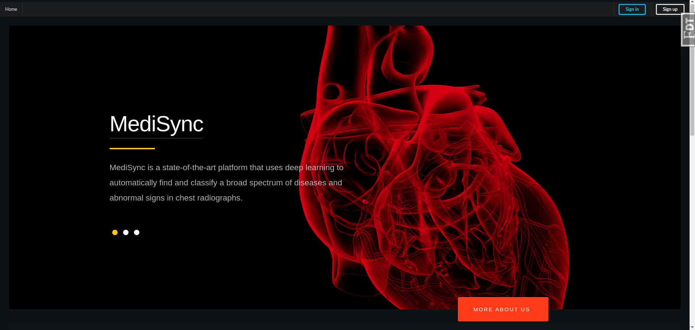
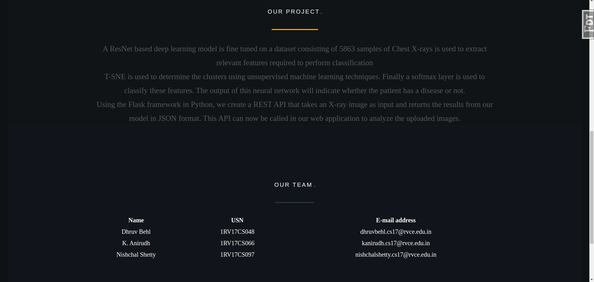
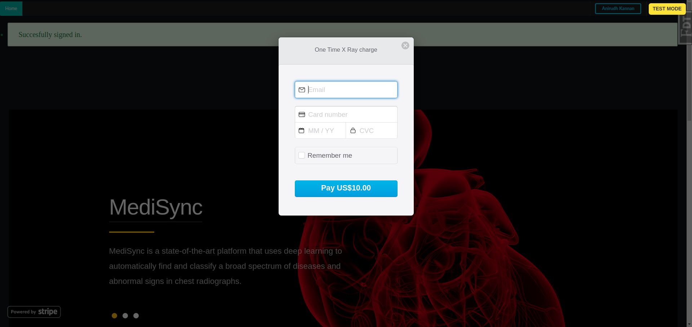
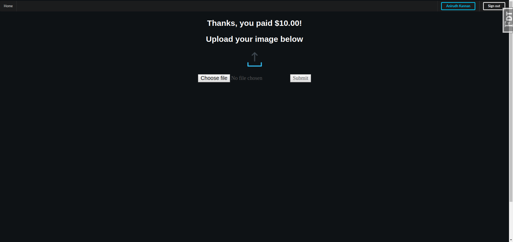
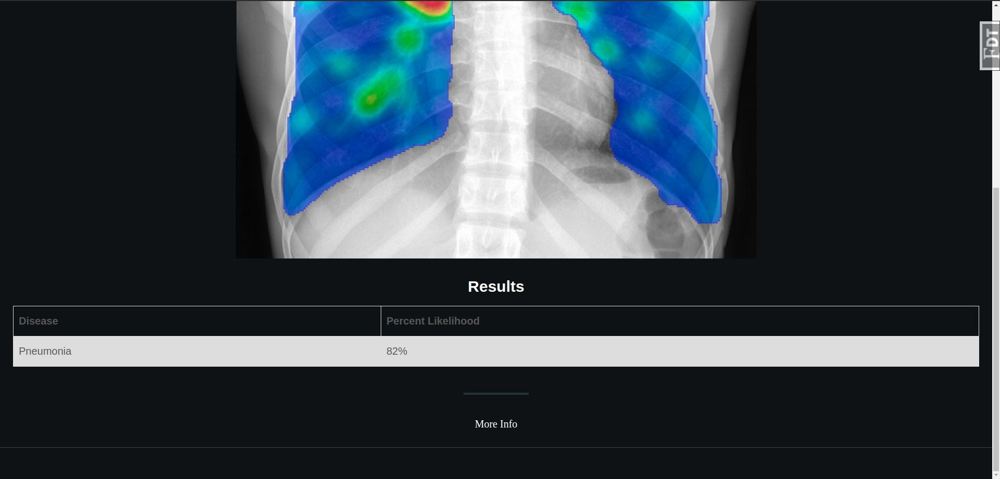
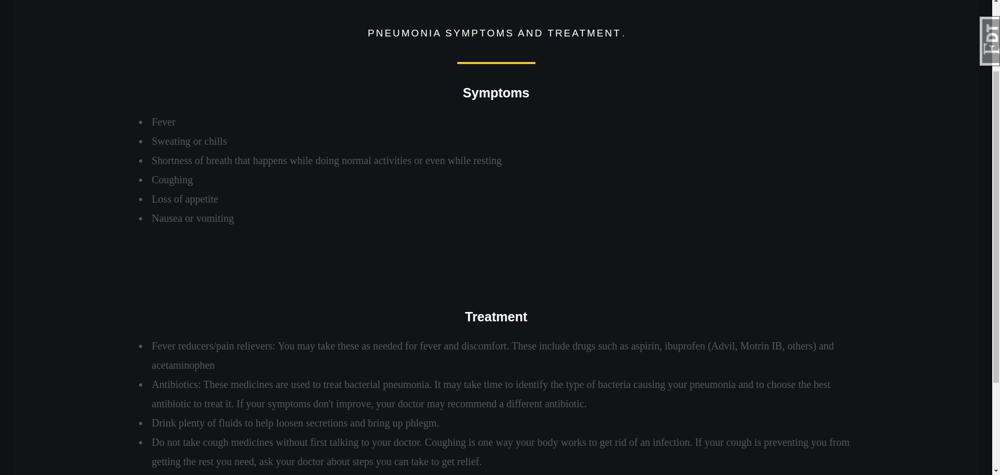

# Automated Medical Image Analysis
In this project, we propose a web-based platform which automates the diagnostic process of Chest X-Ray analysis using state-of-the-art deep learning methods. A report is generated based on the results predicted by our model and this report is sent back to the user as a pdf file.

A ResNet based deep learning model is fine tuned on a dataset consisting of 5863 samples of Chest X-rays is used to extract relevant features required to perform classification. The output of this neural network will indicate whether the patient has a disease(pneumonia) or not.

Semantic UI is used along with Javascript in the frontend and SQLAlchemy is used in the backend of the project.
Using the Flask framework in Python, a REST API, that takes an X-ray image as input and returns the results from our model in JSON format, is created. This API can now be called in the web application to analyze the uploaded images.

The following are some screenshots of the project:

